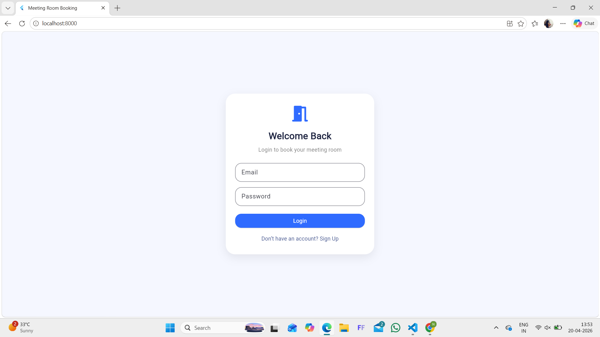
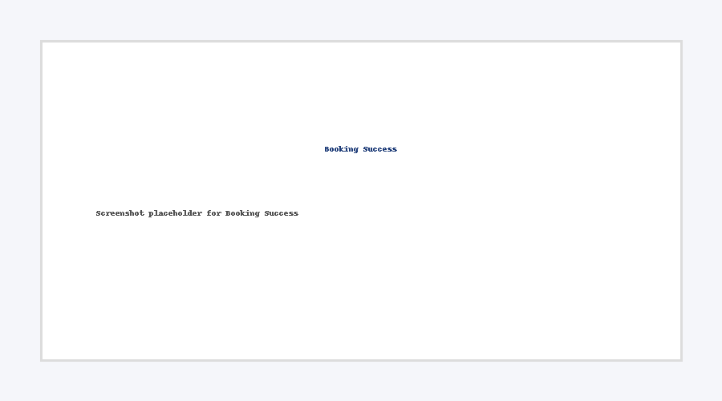

# meeting-room-booking-flutter-app

A Flutter + Firebase meeting room booking application with login, booking flow, profile dashboard, and modern responsive UI.

## Features

- Login / Signup with Firebase Authentication
- Book meeting rooms by date and time
- My Bookings page
- Profile page with total bookings and logout
- Real-time Firestore integration
- Responsive modern UI for web/mobile

## Tech Stack

- Flutter
- Dart
- Firebase Auth
- Cloud Firestore

## Screenshots

### Login Page

### Home Screen

### Booking Success

### Profile Page

## Project Use Case

This app is suitable for:
- offices
- coworking spaces
- institutions
- admin booking systems

## Live Skills Demonstrated

- Flutter UI design
- Firebase integration
- authentication flow
- real-time database usage
- responsive layout building

## Freelance Availability

I am available for freelance Flutter app projects, booking systems, admin apps, and business mobile apps.

## Connect with me

- LinkedIn: https://www.linkedin.com/in/nethra-nekar-ab2494259/
- Fiverr: https://www.fiverr.com/users/nethranekar22/seller_dashboard

## Author

Nethra Nekar
