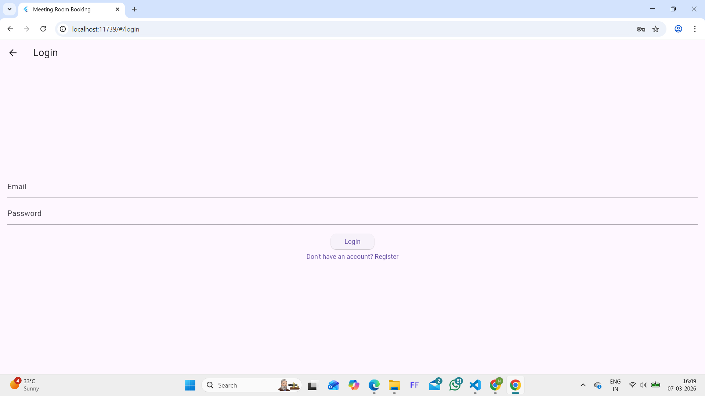
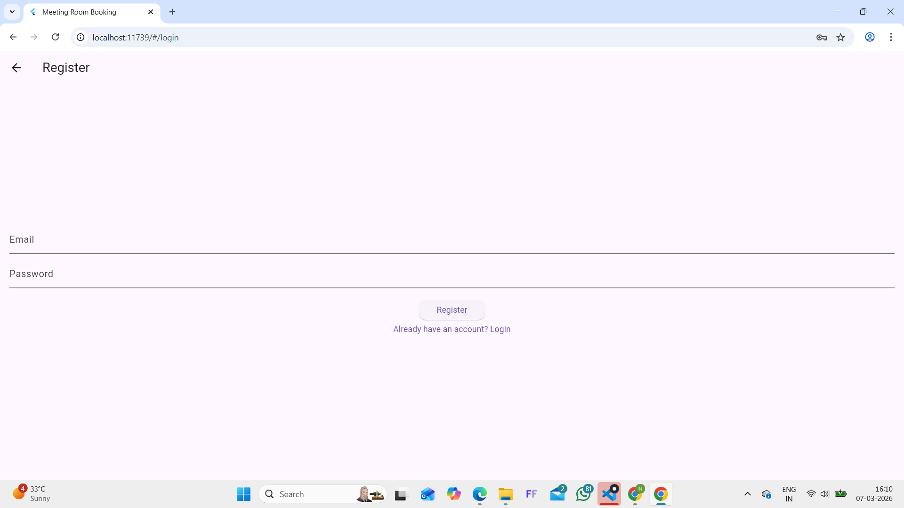
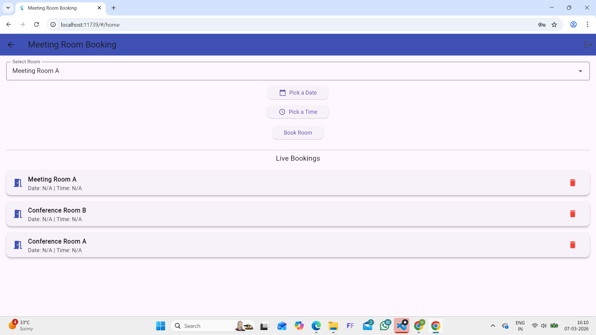

# Meeting Room Booking App

A professional Flutter application for booking meeting rooms with Firebase backend.

## 🎯 Features

- ✅ **Firebase Authentication** - Email/Password Login & Registration
- ✅ **Meeting Room Selection** - Choose from 4 available rooms
- ✅ **Date Picker System** - Intuitive date selection
- ✅ **Time Slot Booking** - Select start and end times
- ✅ **Double Booking Prevention** - Real-time validation to prevent conflicts
- ✅ **Live Booking List** - Real-time updates from Firestore
- ✅ **Delete Bookings** - Remove reservations instantly
- ✅ **Admin Dashboard** - Separate admin interface
- ✅ **Role-Based Navigation** - Users directed based on role
- ✅ **Responsive UI** - Clean Material Design

## Screenshots
### Login Screen

### Booking Screen

### Live Bookings


## 🛠️ Tech Stack

- **Frontend**: Flutter, Dart
- **Backend**: Firebase Cloud Platform
- **Database**: Cloud Firestore (Real-time NoSQL)
- **Authentication**: Firebase Authentication
- **Platforms**: Android, iOS, Web, Windows
- **UI Framework**: Material Design 3

## 📱 App Flow

### User Booking Process
1. Login with Firebase email/password
2. Select a meeting room from dropdown
3. Click "Pick a Date" to open calendar
4. Choose date (must be today or future)
5. Select start time
6. Select end time
7. Click "Book Room"
8. Booking appears instantly in Live Bookings list
9. Delete bookings with trash icon anytime

### Admin Process
- Login with admin account
- Sees Admin Dashboard instead of booking page
- Admin can still manage bookings from user interface
- Logout button in top-right corner

## 📦 Project Structure

```
lib/
├── main.dart                      # App entry point
├── firebase_options.dart          # Firebase config
│
├── screens/
│   ├── login_screen.dart          # Login & role checking
│   ├── register_screen.dart       # User registration
│   └── admin_dashboard.dart       # Admin interface
│
├── pages/
│   └── home_page.dart             # Booking page
│
├── models/
│   └── booking.dart               # Booking data model
│
└── services/
    └── firestore_service.dart     # Database operations
```

## 🚀 Getting Started

### Prerequisites
- Flutter SDK (latest)
- Android SDK or iOS DevTools
- Firebase account with active project
- Java 17+ installed

### Installation

```bash
# Clone repository
git clone https://github.com/yourname/meeting-room-booking-app.git
cd meeting-room-booking-app

# Install dependencies
flutter pub get

# Run on web (development)
flutter run -d chrome

# Run on Windows
flutter run -d windows
```

## 📦 Build for Android

```bash
flutter clean
flutter pub get
flutter build apk --release
```

**APK Location**: `build/app/outputs/flutter-apk/app-release.apk`
**Size**: ~47 MB
**Installation**: Transfer to phone, allow unknown sources, install

## 🔐 Firebase Setup

### Firestore Indexes
```json
{
  "indexConfig": {
    "indexes": [{
      "collectionId": "bookings",
      "fields": [
        {"fieldPath": "room", "order": "ASCENDING"},
        {"fieldPath": "date", "order": "ASCENDING"}
      ]
    }]
  }
}
```

### Firestore Rules
```
rules_version = '2';
service cloud.firestore {
  match /databases/{database}/documents {
    match /bookings/{document=**} {
      allow read, write: if request.auth != null;
    }
    match /users/{userId} {
      allow read: if request.auth != null;
      allow write: if request.auth.uid == userId;
    }
  }
}
```

### Collections Structure

**users collection**:
```json
{
  "email": "user@example.com",
  "role": "user" // or "admin"
}
```

**bookings collection**:
```json
{
  "room": "Meeting Room A",
  "date": "7/3/2026",
  "startTime": "10:00 AM",
  "endTime": "11:00 AM",
  "createdAt": "2026-03-07T..."
}
```

## 📝 Code Examples

### Login with Role Check
```dart
User? user = FirebaseAuth.instance.currentUser;
DocumentSnapshot userDoc = await FirebaseFirestore.instance
    .collection('users')
    .doc(user!.uid)
    .get();

if (userDoc['role'] == 'admin') {
  // Navigate to AdminDashboard
} else {
  // Navigate to HomePage
}
```

### Date Picker
```dart
ElevatedButton(
  onPressed: () async {
    DateTime? picked = await showDatePicker(
      context: context,
      initialDate: DateTime.now(),
      firstDate: DateTime.now(),
      lastDate: DateTime(2030),
    );
    if (picked != null) {
      setState(() => selectedDate = picked);
    }
  },
  child: Text(selectedDate == null ? "Pick Date" : "Date: $selectedDate"),
)
```

### Book Room with Validation
```dart
// Check double booking
final existing = await FirebaseFirestore.instance
    .collection("bookings")
    .where("room", isEqualTo: selectedRoom)
    .where("date", isEqualTo: dateStr)
    .get();

if (existing.docs.isEmpty) {
  // Add booking
  await FirebaseFirestore.instance.collection("bookings").add({
    "room": selectedRoom,
    "date": dateStr,
    "startTime": startTime,
    "endTime": endTime,
  });
}
```

## 🎓 What You Learn

- **State Management**: Using `setState` and StreamBuilder
- **Firebase Integration**: Auth, Firestore, real-time updates
- **Date/Time Pickers**: Flutter Material components
- **Validation Logic**: Double booking prevention
- **Real-time Database**: Firestore queries and snapshots
- **Navigation**: Role-based routing
- **Material Design**: Professional UI/UX

## 📊 Performance

- **Build Time**: ~2-3 mins (first time)
- **APK Size**: 47 MB
- **Firestore Reads**: Optimized with specific queries
- **Real-time Updates**: 100ms - 1s latency
- **UI Responsiveness**: 60 FPS

## 🚧 Future Enhancements

- [ ] Time slot blocking (prevent overlaps)
- [ ] Email notifications for bookings
- [ ] Recurring bookings
- [ ] Booking history/analytics
- [ ] Room capacity management
- [ ] Calendar view of bookings
- [ ] Export to PDF/CSV
- [ ] Dark mode support
- [ ] Multi-language support
- [ ] Push notifications

## 🐛 Troubleshooting

### Date picker not opening?
Make sure `onPressed` is not null and `showDatePicker` is properly called.

### Double booking errors?
Check Firestore rules allow read/write for authenticated users.

### Firebase not found?
Verify `google-services.json` and `GoogleService-Info.plist` are in correct locations.

### Gradle build fails?
```bash
flutter clean
flutter pub get
taskkill /IM java.exe /F
flutter pub get
flutter build apk
```

## 📞 Support

Report issues on GitHub: https://github.com/nethranekar88-tech/meeting-room-booking-app/issues

## 📄 License

MIT License - Feel free to use in your projects

## 💼 Portfolio Description

**For Job Applications & Freelancing:**

> **Meeting Room Booking App** - Flutter & Firebase
> 
> • Developed a full-stack meeting room reservation system using Flutter
> • Implemented Firebase Authentication with role-based access control
> • Integrated Cloud Firestore for real-time booking data management
> • Built booking validation to prevent double-booking conflicts
> • Created responsive Material Design UI with date/time pickers
> • Admin dashboard with user management capabilities
> • Deployed on web and generated release APK for Android
>
> **Key Metrics**: 47 MB APK, 4 rooms, real-time updates, 0 conflicts
>
> **Technologies**: Flutter, Dart, Firebase Auth, Firestore, Material Design

---

**Built with ❤️ using Flutter & Firebase**

*Last Updated: March 2026*


